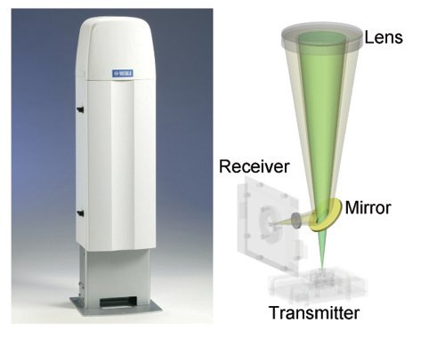

.. Boundary Layer Ceilometer Retrieval documentation master file, created by
   sphinx-quickstart on Sun Feb 18 15:08:23 2018.
   You can adapt this file completely to your liking, but it should at least
   contain the root `toctree` directive.

Welcome to Boundary Layer Ceilometer Retrieval's documentation!
===============================================================

This is the documentation for the retrieval of boundary layer structure from Ceilometer Data from the Spectroscopy and Remote Sensing (EPR) Group at UNAM, Mexico.

Since 2008, a commercial lidar system, the Vaisala CL31 ceilometer, has been measuring backscattering profiles with a :math:`\sim 10` [m] vertical resolution and a temporal resolution
ranging from 2 to 16 s. Through the analysis of these profiles, :cite:`jlgf2018` showed the typical diurnal and seasonal variability of the mixed-layer height.

Figure 1. Ceilometer Vaisala CL31. This instrument is an optical active remote sensing instrument equipped with an eye-safe laser that interacts with atmospheric aerosols in such a way that
the backscattered signal has been found to be a good proxy for aerosol distribution :cite:`brooks2003,jlgf2018`.

.. toctree::
   :name: mastertoc
   :numbered:
   :maxdepth: 5
   :caption: Contents:

   processing
   secondary
   tools
   dftools
   gallery
   

.. _linking-pages:

=============
Linking Pages
=============

| `Grupo de Espectroscopia y Percepcion Remota (EPR), Centro de Ciencias de la Atmosfera, UNAM <https://www.atmosfera.unam.mx/ciencias-ambientales/espectroscopia-y-percepcion-remota/>`_.
| `Laboratorio de Espectroscopia y Percepcion Remota <https://www.atmosfera.unam.mx/ciencias-ambientales/espectroscopia-y-percepcion-remota/laboratorio-de-espectroscopia/>`_.
| `Red Universitaria de Observatorios Atmosfericos <http://www.ruoa.unam.mx/>`_.

   .. sectionauthor:: Garcia-Franco J.L. <jgcaspark@ciencias.unam.mx>

Authors and Contributions
--------------------------

| Lead Scientists: *Grutter, M., Bezanilla A., Stremme W., Ruiz-Angulo A.*
| Main code author: *Garcia-Franco J.L.*
| Original code: *Stremme W.*
| Contributions from: *Burgos A.*

Indices and tables
==================

* :ref:`genindex`
* :ref:`modindex`
* :ref:`search`
